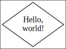
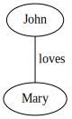
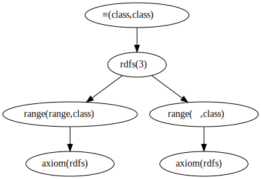
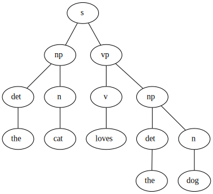

# Prolog-based graph visualization

A Prolog-based library for visualizing graphs that uses the GraphViz
library.

## Dependencies

  1. Install [SWI-Prolog](https://www.swi-prolog.org).

  2. Install the GraphViz library:

```sh
apt install graphviz # Debian, Ubuntu
dnf install graphviz # Fedora, Red Hat
```

## Installation

Install this library:

```sh
swipl -g 'pack_install(prolog_graphviz)' -t halt
```

## Use

Once installed, modules from this library are loaded as follows:

```pl
?- [library(gv)].
```

### Exporting a single node

The basic feature of this library is that it allows you to write to a
GraphViz output file or to a GraphViz viewer by simply writing to a
Prolog output stream.  The following example (see
[`example/hello.pl`](example/hello.pl)) shows how to write a graph
consisting of one node, and open the result in a GraphViz viewer:

```pl
?- gv_view([Out]>>format(Out, "x [label=<Hello,<BR/>world!>,shape=diamond];\n", [])).
```

This opens the following image inside a GraphViz-compatible viewer:



### Exporting a single edge

In this example (see [`example/loves.pl`](example/loves.pl)) we write
a graph that consists of a single edge:

```pl
?- gv_export('loves.svg', [Out]>>format(Out, "John -- Mary [label=loves];\n", [])).
```

This writes the following image to an SVG file.  See the table in
Section [Output formats](#output-formats-option-format1) for a full
list of supported output formats.



## Advanced use

While you can use this library by directly writing DOT strings to an
output stream, more advanced export tasks often benefit from using the
library's support predicates.  The most important ones are:

  - `dot_node/[2,3]` for exporting nodes.
  - `dot_arc/[3,4]` for exporitng (directed) arcs.
  - `dot_edge/[3,4]` for exporting (undirected) edges.

`dot_arc/4` and `dot_edge/4` take a list of options that are emitted
as GraphViz attributes.  Option `label(+or([string,list(string)]))`
allows (multi-line) Unicode labels to be emitted using HTML-like
labels (see Section [HTML-like labels](#html-like-labels)).

### Exporting a proof tree

Suppose your program returns proof trees that consist of an entailment
rule label, a conclusion, and an arbitrary number of premises:

```pl
?- Proof = t(rdfs(3),∈(class,class),[t(axiom(rdfs),range(range,class),[]),
                                     t(axiom(rdfs),range(⊆,class),[])]).
```

The following program (see
[`example/proof_tree.pl`](example/proof_tree.pl)) exports such proof
trees.  Notice that this program uses the support predicates.  This
allows the nodes to be characterized by Prolog terms instead of DOT
IDs.  For most programs this results in simplified code because.
Since these support predicates are idempotent, emitting the same
node/edge multiple times does not accidentally change the exported
graph.

```pl
:- use_module(library(apply)).
:- use_module(library(graph/gv)).
:- use_module(library(yall)).

view_proof(Proof) :-
  gv_view({Proof}/[Out]>>export_proof(Out, Proof), [directed(true)]).

export_proof(Out, Tree) :-
  Tree = t(Rule,Concl,Prems),
  dot_node(Out, Concl),
  dot_node(Out, Tree, [color(green),label(Rule)]),
  dot_arc(Out, Concl, Tree),
  maplist(export_subproof(Out, Tree), Prems).

export_subproof(Out, Node, Tree) :-
  Tree = t(_Rule,Concl,_Prems),
  dot_node(Out, Concl),
  dot_arc(Out, Node, Concl),
  export_proof(Out, Tree).
```

Since we use the predicate `dot_arc/3`, we must specify option
`directed(true)` (graphs are undirected by default).

In order to open a specific proof tree, like `$Proof`, in a
GraphViz-compatible viewer, we make the following call:

```pl
?- view_proof($Proof).
```

This produces the following visualization:



### Exporting a parse trees

Suppose your program returns syntactic parse trees like the following:

```pl
?- Tree = s(np(det(the),n(cat)),vp(v(loves),np(det(the),n(dog))))
```

The following code exports such parse trees to SVG (see
[`example/parse_tree.pl`](example/parse_tree.pl)):

```pl
:- use_module(library(apply)).
:- use_module(library(graph/gv)).
:- use_module(library(yall)).

export_tree(Tree) :-
  gv_export('parse_tree.svg', {Tree}/[Out]>>export_tree(Out, Tree, _)).

export_tree(Out, Tree, Id) :-
  Tree =.. [Op|Trees],
  dot_id(Id),
  dot_node_id(Out, Id, [label(Op)]),
  maplist(export_tree(Out), Trees, Ids),
  maplist(dot_edge_id(Out, Id), Ids).
```

Notice that in the above program we use `dot_node_id/3` instead of
`dot_node/3` and `dot_edge_id/3` instead of `dot_edge/3`.  The `*_id`
versions require us to supply the DOT IDs ourselves.  Arbitrary DOT
IDs are generated with `dot_id/1`.

We can generate the visualization for the above syntax tree (`$Tree`),
by making the following call:

```pl
?- export_tree($Tree).
```

This prodices the following result:



Notice that we create a new DOT ID (`dot_id/1`) for each node in the
tree.  Because of this, the two occurrences of ‘the’ can be
distinguished.

## Directed arcs or undirected edges?

Both directed and undirected graphs can be exported.  By default,
`gv_export/[2,3]` and `gv_view/[1,2]` export undirected graphs.
Directed graphs are exported by setting the `directed(true)` option in
`gv_export/3` or `gv_view/2`.  For undirected graphs, undirected edges
are emitted with `dot_edge/[3,4]` and `dot_edge_id/[3,4]`.  For
directed graph, directed edges or arcs are emitted with
`dot_arc/[3,4]` and `dot_arc_id/[3,4]`.

## Debugging graph exports

Sometimes when you use this library, or any other graph export
library, a graph export may come out incorrectly: it either does not
compile, or it does compile but looks weird.  In such cases, it is
convenient to be able to print the content that is exported to the
top-level for inspection by the programmer.  Printing the export to
the top-level can be enabled with `debug(dot)`, and disabled by
`nodebug(dot)` (see library debug for more information).

## Options

This section gives a full enumeration of the values that are supported
by this library's options.

### Layout methods (option `method/1`)

The followig GraphViz layout methods are supported.  They can be
specified with the `method(+atom)` option in `gv_export/[2,3]` and
`gv_view/[1,2]`.

| Method      |  Use case                |
| ----------- | ------------------------ |
| `circo`     | Circular graph layouts.  |
| `dot`       | Directed graphs.         |
| `fdp`       | Undirected graphs.       |
| `neato`     | Undirected graphs.       |
| `osage`     | Array-based layouts.     |
| `patchwork` | Squarified tree maps.    |
| `sfdp`      | Large undirected graphs. |
| `twopi`     | Radial graph layouts.    |

### Output formats (option `format/1`)

The following GraphViz output formats are supported.  They can be
specified with the `format(+atom)` option in `gv_export/[2,3]` and
`gv_view/[1,2]`.

| Extension   | Type   | Media Type                                                 | Description                                                                                                                           |
| ----------- | ------ | ---------------------------------------------------------- | ------------------------------------------------------------------------------------------------------------------------------------- |
| `bmp`       | binary | `image/bmp`                                                | Windows Bitmap (BMP)                                                                                                                  |
| `canon`     | text   |                                                            | A prettyprinted version of the DOT input, with no layout performed.                                                                   |
| `cgimage`   | binary |                                                            | CGImage, a drawable image object in Core Graphics (the low-level procedural drawing API for iOS and Mac OS X).                        |
| `cmap`      | text   |                                                            | Client-side image map files.  Not well-formed XML.                                                                                    |
| `cmapx`     | text   |                                                            | Server-side and client-side image map files.  Well-formed XML.                                                                        |
| `cmapx_np`  | text   |                                                            | Like `cmapx`, but only using rectangles as active areas.                                                                              |
| `dot`       | text   | `text/vnd.graphviz`                                        | Reproduces the DOT input, along with layout information.                                                                              |
| `dot_json`  | text   | `application/json`                                         | JSON representation of the content (i.e., non-layout) information of the `dot` format.                                                |
| `eps`       | binary | `image/eps`                                                | Encapsulated PostScript (EPS)                                                                                                         |
| `exr`       | binary |                                                            | OpenEXR: a high dynamic-range (HDR) image file format developed by Industrial Light & Magic for use in computer imaging applications. |
| `fig`       | text   |                                                            | FIG graphics format used by Xfig.                                                                                                     |
| `gd`        | text   |                                                            | GD format (`libgd`).                                                                                                                  |
| `gd2`       | binary |                                                            | GD2 format (`libgd`, compressed)                                                                                                      |
| `gif`       | binary | `image/gif`                                                | Graphics Interchange Format (GIF)                                                                                                     |
| `gtk`       | viewer |                                                            | GTK-based viewer                                                                                                                      |
| `gv`        | text   |                                                            | Same as `dot`.                                                                                                                        |
| `ico`       | binary | `image/vnd.microsoft.icon`                                 | Windows icon format                                                                                                                   |
| `imap`      | text   |                                                            | Same as `cmapx`.                                                                                                                      |
| `imap_np`   | text   |                                                            | Same as `cmapx_np`.                                                                                                                   |
| `ismap`     | text   |                                                            | HTML image map                                                                                                                        |
| `jp2`       | binary | `image/jp2`                                                | JPEG 2000                                                                                                                             |
| `jpe`       | binary | `image/jpeg`                                               | Same as `jpeg`.                                                                                                                       |
| `jpeg`      | binary | `image/jpeg`                                               | Joint Photographic Experts Group (JPEG)                                                                                               |
| `jpg`       | binary | `image/jpeg`                                               | Same as `jpeg`.                                                                                                                       |
| `json`      | text   | `application/json`                                         | JSON representation of the content an layout information of the `xdot` format.                                                        |
| `json0`     | text   | `application/json`                                         | JSON representation of the content an layout information of the `dot` format.                                                         |
| `pct`       | binary | `image/x-pict`                                             | PICT: A graphics file format introduced on the original Apple Macintosh computer as its standard metafile format.                     |
| `pdf`       | binary | `application/pdf`                                          | Portable Document Format (PDF)                                                                                                        |
| `pic`       | text   |                                                            | PIC language developed for troff.                                                                                                     |
| `pict`      | text   |                                                            | Same as `pic`.                                                                                                                        |
| `plain`     | text   |                                                            | A simple, line-based language.                                                                                                        |
| `plain-ext` | text   |                                                            | Like `plain`, but providing port names on head and tail nodes when applicable.                                                        |
| `png`       | text   | `image/png`                                                | Portable Network Graphics (PNG)                                                                                                       |
| `pov`       | binary |                                                            | Scene-description language for 3D modelling for the Persistence of Vision Raytracer.                                                  |
| `ps`        | binary | `application/postscript`                                   | PostScript                                                                                                                            |
| `ps2`       | binary |                                                            | PostScript output with PDF notations                                                                                                  |
| `psd`       | binary | `image/vnd.adobe.photoshop`                                | Adobe Photoshop PSD                                                                                                                   |
| `sgi`       | binary | `image/sgi`                                                | Silicon Graphis Image (SGI)                                                                                                           |
| `svg`       | text   | `image/svg+xml`                                            | Scalable Vector Graphics (SVG)                                                                                                        |
| `svgz`      | binary | `application/gzip`                                         | GNU zipped SVG                                                                                                                        |
| `tga`       | binary | `image/x-targa`                                            | Truevision Advanced Raster Graphics Adapter (TARGA)                                                                                   |
| `tif`       | binary | `image/tiff`                                               | Same as `tiff`.                                                                                                                       |
| `tiff`      | binary | `image/tiff`                                               | Tagged Image File Format (TIFF)                                                                                                       |
| `tk`        | text   |                                                            | TK graphics primitives                                                                                                                |
| `vdx`       | text   |                                                            | Microsoft Visio XML drawing                                                                                                           |
| `vml`       | text   | `application/vnd.openxmlformats-officedocument.vmlDrawing` | Vector Markup Lanuage (VML)                                                                                                           |
| `vmlz`      | binary |                                                            | GNU zipped VML                                                                                                                        |
| `vrml`      | text   | `model/vrml`                                               | Virtual Reality Modeling Language (VRML)                                                                                              |
| `wbmp`      | binary | `image/vnd.wap.wbmp`                                       | Wireless Application Protocol Bitmap Format (WBMP)                                                                                    |
| `webp`      | binary | `image/webp`                                               | Google image format for the web (WebP)                                                                                                |
| `x11`       | viewer |                                                            | X11-based viewer                                                                                                                      |
| `xdot`      | text   | `text/vnd.graphviz`                                        | Like `dot`, but adding more detailed information about how graph components are drawn.                                                |
| `xdot_json` | text   | `application/json`                                         | JSON representation of the content (i.e., non-layout) information of the `xdot` format.                                               |
| `xdot1.2`   | text   | `text/vnd.graphviz`                                        | Same as setting `xdotversion=1.2` with the `xdot` format.                                                                             |
| `xdot1.4`   | text   | `text/vnd.graphviz`                                        | Same as setting `xdotversion=1.4` with the `xdot` format.                                                                             |
| `xlib`      | viewer |                                                            | Same as `x11`.                                                                                                                        |

## HTML-like labels

The DOT language supports several HTML-like facilities that allow rich
labels to be printed for arcs, edges, and nodes.  These can be
specified by option `label(+or([string,list(string)]))`, which takes
either a string or a list of strings.  In a list of strings, each
string represents one line in a multi-line label.

Strings must adhere to the following BNF grammar for DOT HTML-like
labels:

```bnf
label : text
      | table
text : textitem
     | text textitem
textitem : string
         | <BR/>
         | <FONT> text </FONT>
         | <I> text </I>
         | <B> text </B>
         | <U> text </U>
         | <O> text </O>
         | <SUB> text </SUB>
         | <SUP> text </SUP>
         | <S> text </S>
table : [ <FONT> ] <TABLE> rows </TABLE> [ </FONT> ]
rows : row
     | rows row
     | rows <HR/> row
row: <TR> cells </TR>
cells : cell
      | cells cell
      | cells <VR/> cell
cell: <TD> label </TD>
    | <TD>  </TD>
```

In addition to the above BNF grammar, tags are allowed to have
attributes that are formatted similar to HTML attributes.  Different
tags support different sets of attributes:

### Supported attributes for `TABLE`

  - `ALIGN="CENTER|LEFT|RIGHT"`
  - `BGCOLOR="color"`
  - `BORDER="value"`
  - `CELLBORDER="value"`
  - `CELLPADDING="value"`
  - `CELLSPACING="value"`
  - `COLOR="color"`
  - `COLUMNS="value"`
  - `FIXEDSIZE="FALSE|TRUE"`
  - `GRADIENTANGLE="value"`
  - `HEIGHT="value"`
  - `HREF="value"`
  - `ID="value"`
  - `PORT="portName"`
  - `ROWS="value"`
  - `SIDES="value"`
  - `STYLE="value"`
  - `TARGET="value"`
  - `TITLE="value"`
  - `TOOLTIP="value"`
  - `VALIGN="MIDDLE|BOTTOM|TOP"`
  - `WIDTH="value"`

### Supported attributes for `BR`

  - `ALIGN="CENTER|LEFT|RIGHT"`

### Supported attributes for `FONT`

  - `COLOR="color"`

    Sets the color of the font of text that appears within
    `<FONT>…</FONT>`, or the border color of the table or cell within
    the scope of `<TABLE>…</TABLE>`, or `<TD>…</TD>`.  This color can
    be overridden by `COLOR` attributes in descendents.  By default,
    the font color is determined by the GraphViz `fontcolor` attribute
    of the corresponding node, edge or graph, and the border color is
    determined by the GraphViz `color` attribute of the corresponding
    node, edge or graph.

  - `FACE="fontname"`

  - `POINT-SIZE="value"`

### Supported attributes for `IMG`

  - `SCALE="FALSE|TRUE|WIDTH|HEIGHT|BOTH"`
  - `SRC="value"`

### Supported attributes for `TD`

  - `ALIGN="CENTER|LEFT|RIGHT|TEXT"`
  - `BALIGN="CENTER|LEFT|RIGHT"`
  - `BGCOLOR="color"`
  - `BORDER="value"`
  - `CELLPADDING="value"`
  - `CELLSPACING="value"`
  - `COLOR="color"`
  - `COLSPAN="value"`
  - `FIXEDSIZE="FALSE|TRUE"`
  - `GRADIENTANGLE="value"`
  - `HEIGHT="value"`
  - `HREF="value"`
  - `ID="value"`
  - `PORT="portName"`
  - `ROWSPAN="value"`
  - `SIDES="value"`
  - `STYLE="value"`
  - `TARGET="value"`
  - `TITLE="value"`
  - `TOOLTIP="value"`
  - `VALIGN="MIDDLE|BOTTOM|TOP"`
  - `WIDTH="value"`
